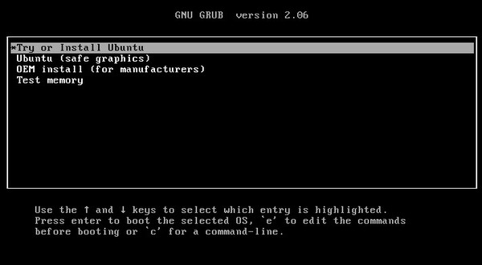
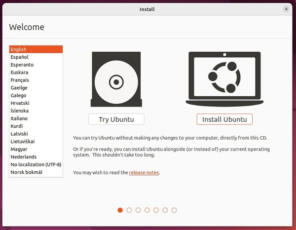
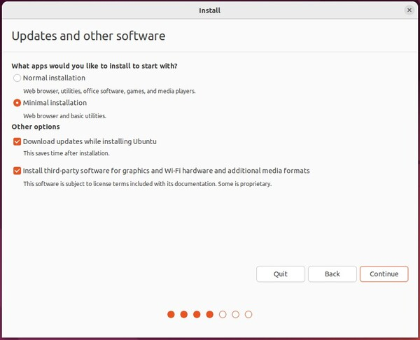
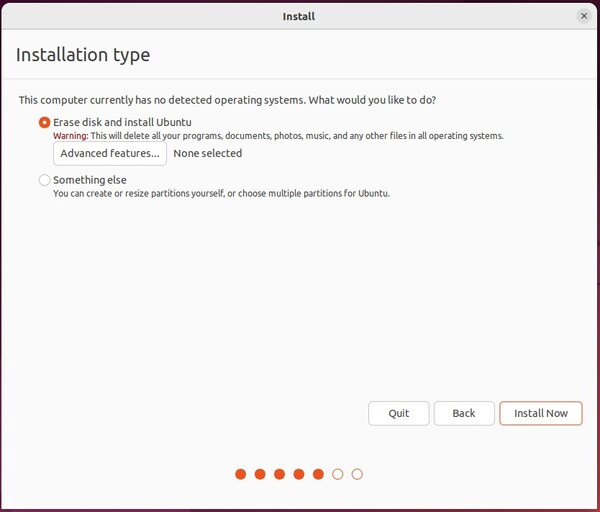
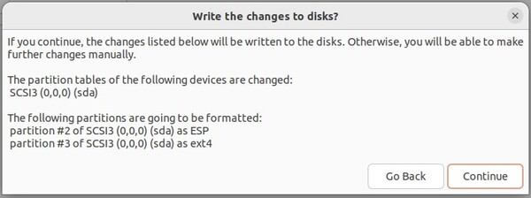
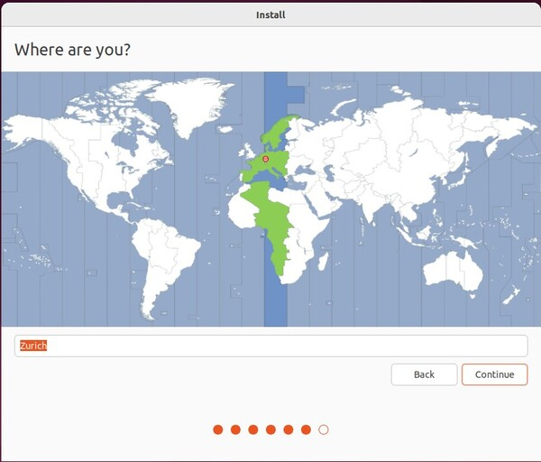
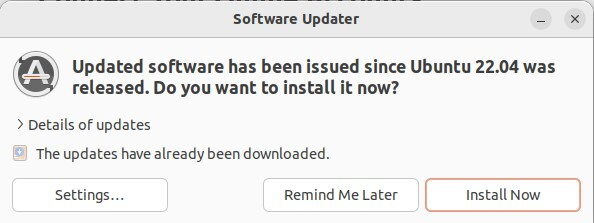
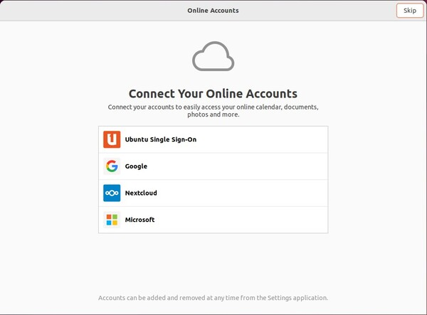
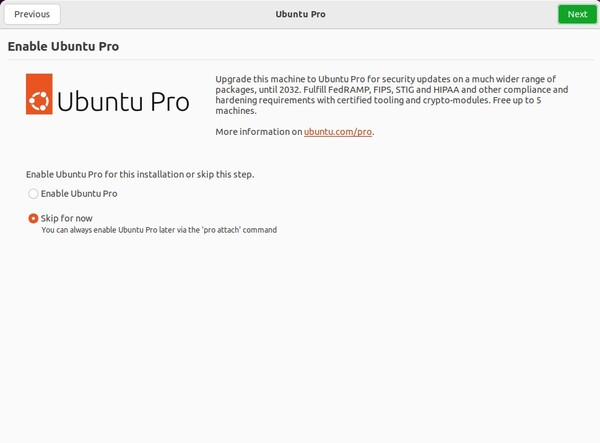
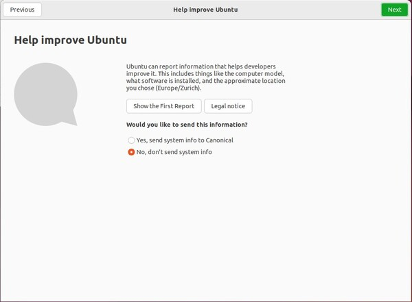

---
title: "Radar Demo"
author: [David Stadelmann]
date: "2017-02-20"
subject: "Installation"
subtitle: "User Guide"
...

# System Installation - Ubuntu 22.04

1. Power off the system
2. Plugin the Ubuntu 22.04 USB stick
3. Install Ubuntu 22.04



<div style="page-break-after: always; visibility: hidden"> 
\pagebreak 
</div>

Wait until the system boots and wait until you see following screen



<div style="page-break-after: always; visibility: hidden"> 
\pagebreak 
</div>

Keyboard Layout


<div style="page-break-after: always; visibility: hidden"> 
\pagebreak 
</div>

Select the minimal installation and if you have access to the internet, download updates while installing Ubuntu



<div style="page-break-after: always; visibility: hidden"> 
\pagebreak 
</div>

Install by erasing disk and install Ubuntu  



<div style="page-break-after: always; visibility: hidden"> 
\pagebreak 
</div>

Confirm - Write the changes to disk?  



<div style="page-break-after: always; visibility: hidden"> 
\pagebreak 
</div>

Select location  



<div style="page-break-after: always; visibility: hidden"> 
\pagebreak 
</div>

As credentials set following values:

**Your name:** demo  
**Your computer's name:** lightning (intel), thunder (intel), rainbow (amd), unicorn (amd)  
**Pick a username:** demo  
**Choose a password:** xxxxxx  
**Log in automatically**


<div style="page-break-after: always; visibility: hidden"> 
\pagebreak 
</div>

Update the software for Ubuntu 22.04



<div style="page-break-after: always; visibility: hidden"> 
\pagebreak 
</div>

**Do not** update to Ubuntu 24.04


<div style="page-break-after: always; visibility: hidden"> 
\pagebreak 
</div>

Reboot the system. You will be prompted to remove the USB Stick



<div style="page-break-after: always; visibility: hidden"> 
\pagebreak 
</div>

Skip Ubuntu Pro



<div style="page-break-after: always; visibility: hidden"> 
\pagebreak 
</div>

Do not send system info



<div style="page-break-after: always; visibility: hidden"> 
\pagebreak 
</div>

Disable Location Services


<div style="page-break-after: always; visibility: hidden"> 
\pagebreak 
</div>

Finalize with Done


#### Power Settings


Make sure to select *Never* from the **Screen Blank** options


#### Remove Favorites

Right click on the icons in the top left corner and select "Remove from Favorites"


# Radar Demo Application 
## Install Essentials

Open a terminal by pressing and releasing the meta key (Windows Key). Start typing terminal and select the "Terminal" icon


Install the tools required for updateing the demo application
```console
> sudo apt install git git-lfs ansible

```


you will be prompted for the password -> xxxxxx


## Copy the application data

### Using the github repository

Open a terminal. Opening the terminal is described in [Install Essentials](#install-essentials)
Then execute the following commands:
```console
> cd /home/demo
> git clone git@github.com:scs/radar-demo
> cd radar-demo
> ./update.sh
> sudo reboot
```

### Using a usb stick

Copy the repository from the stick to the demo user home directory as radar-demo


Open a terminal. Opening the terminal is described in [Install Essentials](#install-essentials)
Then execute the following commands:
```console
> cd /home/demo/radar-demo
> git checkout .
> ./update.sh
> sudo reboot
```

Instead of using git clone you might use a usb stick to copy the data to the system

This will update the repo, install all relevant dependencies and update the
card. It is possible that a reboot is required after running the update script.
Please do not stop the update once started.

For the update the password of the current user is required to gain root
privileges.

For the demo to run you will additionally require the stimuli files. These are
not distributed through git as the size is to large.

The usb stick will contain the stimuli files.

## Card / FW Update

> **Important:**
>
> This can only be done once all previous steps have been completed and the PC has been rebooted.

Open a terminal. Opening the terminal is described in [Install Essentials](#install-essentials)
Then execute the following commands:
```console
> cd /home/demo/radar-demo/update_fw
> ./update_fw.py -s hw
```
If prompted please input the password of the user

After successful update the PC has to be power cycled (not only rebooted).

## Running the application After installation a launcher is installed. One can
call it initially by starting the desktop drawer (the drawer is launched with
the meta key aka Windows Key). This is done with the meta (Windows) key. Then
typing radar-demo should show an radar icon. This can be clicked or confirmed
with enter. To keep the icon on the launcher bar, right click and click 'Add to
Favorites'.

# Appendix

## FAQ

### Network Message

If a network message pops up regularly notifying that no connection could be
established, then this can be mitigated by disabling the ipv4 connection and
setting the ipv6 connection to local only.

Open the settings from the system drop down 


<div style="page-break-after: always; visibility: hidden"> 
\pagebreak 
</div>

Then select the network settings tab

Select the USB network adapter called "enx..." The image is missleading as it was
taken on a VM with no such (USB) device.


<div style="page-break-after: always; visibility: hidden"> 
\pagebreak 
</div>

Disable IPv4 in the IPv4 Tab


<div style="page-break-after: always; visibility: hidden"> 
\pagebreak 
</div>

Set IPv6 in the IPv6 Tab to Link-Local only


<div style="page-break-after: always; visibility: hidden"> 
\pagebreak 
</div>


## USB Ethernet cable
This step does not have to be done normally it is done with the ansible script.
But it is kept here for documentation purposes.

1. Download driver from here [ASIX Driver](https://www.asix.com.tw/en/support/download/file/1892?time=1732778829482)
2. Execute the following steps in a terminal
```
> cd Downloads
> tar -jxvf ASIX_USB_NIC_Linux_Driver_Source_v3.4.0.tar.bz2
> cd ASIX_USB_NIC_Linux_Driver_Source_v3.4.0
> make
> sudo make install
```

Instructions from here [Reddit](https://www.reddit.com/r/HomeNetworking/comments/1ftjlrt/ethernet_over_usb_is_not_working_in_ubuntu_22/?rdt=40984)

